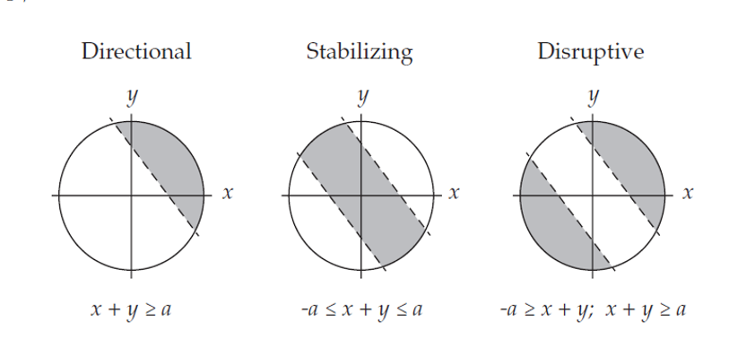

This document demonstrates the Bulmer effect and Bulmer's partitioning of genetic variance using AlphaSimR and traits with only additive effects.

## Bulmer's partitioning of genetic variance

Bulmer had a simulation paper in 1976 where he decomposed genetic variance in the following way:

$V_G = V_g + C_{HW} + C_L$

$V_G$ is total genetic variance.

$V_g$ is genic variance. The expected variance at Hardy-Weinberg and linkage equilibrium.

$C_{HW}$ is the covariance due to the departure from Hardy-Weinberg equilibrium in the observed genotype frequencies.

$V_g + C_{HW}$ is the expected genetic variance at the observed genotype frequencies and linkage equilibrium.

$C_L$ is the covariance due to genetic linkage (i.e. linkage disequilibrium).

This decomposition of genetic variance is implemented in AlphaSimR and can be accessed using the `genParam` function. Moreover, AlphaSimR implements this partitioning on top of the classic partitioning of genetic variance into additive, dominance, and epistasis (additive-by-additive only).

The script below demonstrates how to access this partitioning for additive genetic variance in a simulation using only additive effects. (Note that genetic and additive variances are equivalent with only additive effects)

```{r}
library(AlphaSimR)

# Generate founder haplotypes using MaCS
founderPop = runMacs(nInd=100, nChr=10, segSites=100)

# Set simulation parameter with a single additive trait
SP = SimParam$
  new(founderPop)$
  addTraitA(100, mean=0, var=1)

# Create an initial population
pop = newPop(founderPop)

# Measure mean and variance (defined in SimParam)
meanG(pop)
varG(pop)

# Extract the additive effects
a = SP$traits[[1]]@addEff
hist(a)
mean(a)
var(a)

# Pull the QTL genotypes and calculate allele frequency
QTL = pullQtlGeno(pop)
p = colMeans(QTL)/2
q = 1-p
hist(p)

# Determine the amount of departure from Hardy-Weinberg equilibrium
# prob(heterozygous) = 2*(1-F)*p*q
pHet = colMeans(QTL==1)
F = 1 - pHet/(2*p*q)
hist(F)

# Calculate genetic parameters for the population
gp = genParam(pop)

# Genic variance (HWE and no LD)
gp$genicVarA
sum(2*p*q*a^2)

# Expected genetic variance without LD
gp$genicVarA + gp$covA_HW
sum(2*(1+F)*p*q*a^2)

# Total additive variance
gp$varA
gp$genicVarA + gp$covA_HW + gp$covA_L
```

## Bulmer effect

The below scripts will illustrate the Bulmer effect. The first shows the effect as a more general property by selecting different parts of a bivariate normal distribution to model directional, stabilizing and disruptive selection.



```{r}
# Generate bivariate normally distributed data without correlation
X = matrix(rnorm(2*1000), nrow=1000)

plot(X)
cor(X)

# Order the data by the sum of the two variables
z = rowSums(X)
X = X[order(z, decreasing=TRUE), ]

# Directional selection
cor(X[1:100,])

# Stabilizing selection
cor(X[451:550,])

# Disruptive selection
cor(X[c(1:50, 951:1000),])

```

### Single trait example

The below example will demonstrate the Bulmer effect using a simple simulation. An initial population will be created and subjected to 19 generations of selection before undergoing 20 generations of random mating. The Bulmer effect can be visualized by tracking both the total genetic variance and the genic variance. The genic variance only depends on changes in allele frequency, so it will not experience the Bulmer effect. The difference between genic and genetic variance will be primarily due to LD and the Bulmer effect (assuming negligible departures from HWE).

```{r}

# Create founder population
founderPop = quickHaplo(nInd=1000, nChr=10, segSites=1000)

# Adding 1 trait with heritability of 1
SP = SimParam$
  new(founderPop)$
  addTraitA(1000)$
  setVarE(h2=1)

pop = newPop(founderPop)

# Creating variables to store genic and genetic variance
genicVar = geneticVar = numeric(80)

# Calculate initial variances
gp = genParam(pop)
genicVar[1] = gp$genicVarA
geneticVar[1] = gp$varA[1]

# Subject the population to 19 rounds of selection
for(i in 2:20){
  pop = selectCross(pop, nInd=100, nCrosses=1000)
  
  gp = genParam(pop)
  genicVar[i] = gp$genicVarA
  geneticVar[i] = gp$varA[1]
}

# Subject the population to 60 rounds of random mating
for(i in 21:80){
  pop = selectCross(pop, nInd=100, nCrosses=1000, use="rand")
  
  gp = genParam(pop)
  genicVar[i] = gp$genicVarA
  geneticVar[i] = gp$varA[1]
}

# Plot the change in both variances over time
# Genetic (black) and genic (red)
plot(1:80, geneticVar, type="l",
     ylim=c(0, 1.1),
     xlab="Generation",
     ylab="Variance")
lines(1:80, genicVar, col="red")
```

### Multitrait example

This script will demonstrate how the Bulmer effect applies to multiple traits. It proceeds by first selecting for higher values in both traits for 19 generations before flipping the direction of selection on the second trait for the next 20 generations. I find it a useful demonstration of why we should be careful about attributing biological mechanisms to genetic correlations.

```{r}
founderPop = quickHaplo(nInd=1000, nChr=10, segSites=1000)

# Adding 2 uncorrelated traits
SP = SimParam$
  new(founderPop)$
  addTraitA(1000, 
            mean=c(0,0),
            var=c(1,1),
            corA=diag(2))$
  setVarE(h2=c(1,1))

pop = newPop(founderPop)

# Creating a variable to store genetic correlation
corr = numeric(80)

# Measure initial correlation
gp = genParam(pop)
corr[1] = cor(gv(pop))[1,2]

# Select both traits for positive value for 19 rounds
for(i in 2:20){
  pop = selectCross(pop, nInd=100, nCrosses=1000, 
                    trait=selIndex, b=c(1,1))
  corr[i] = cor(gv(pop))[1,2]
}

# Switch direction on second trait for 20 rounds
for(i in 21:40){
  pop = selectCross(pop, nInd=100, nCrosses=1000, 
                    trait=selIndex, b=c(1,-1))
  corr[i] = cor(gv(pop))[1,2]
}

# Plot changes in genetic correlation
plot(1:40, corr, type="l",
     xlab="Generation",
     ylab="Correlation")
```
